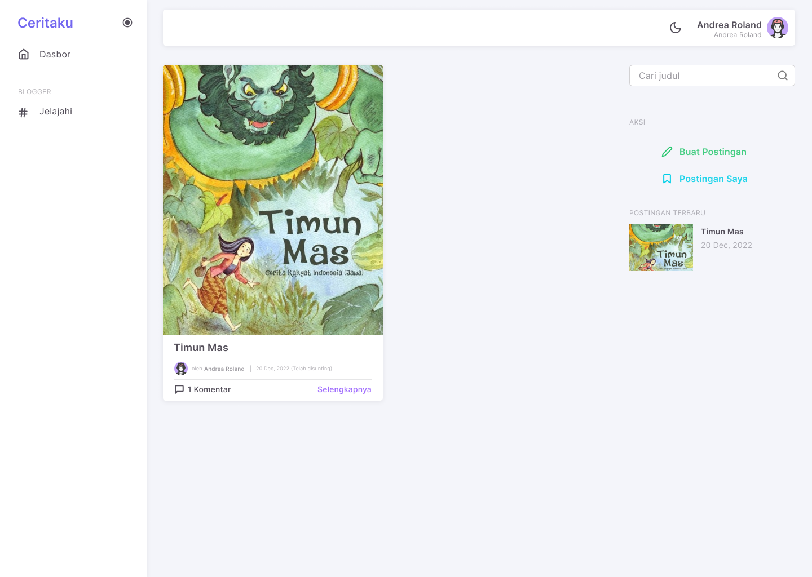

## Fitu Aplikasi CeritaKu

# 1. Halaman Dasbor Tamu
Fitur ini merupakan tampilan utama ketika pengguna mengakses situs ini. Pada halaman ini berisi menu search serta main menu.

# 2. Menu Guest
Menu ini berisi menu login kepada pengguna jika belum masuk ke dalam aplikasi.

# 3. Halaman Masuk / Login
Pada fitur ini pengguna diminta untuk memasukkan nama, email beserta password yang sebelumnya telah diregistrasikan agar dapat mengakses fitur utama pada situs ini, yaitu menulis atau mengunggah cerita.

# 4. Halaman Daftar
Pada fitur ini pengguna diminta memasukkan nama, email dan password untuk didaftarkan terlebih dahulu sebagai akun pengguna. Terdapat juga form konfirmasi password untuk mengkonfirmasi password yang digunakan oleh pengguna apakah sesuai atau tidak dengan password yang dimasukkan pada form pertama.

# 5. Halaman Dasbor
Fitur ini merupakan tampilan utama ketika pengguna telah masuk ke dalam situs ini. Pada halaman ini berisi menu search serta main menu seperti dasbor dan jelajah.

# 6. Halaman Jelajah
Merupakan sebuah fitur untuk menjelajahi postingan. Pada fitur ini berisi list postingan CeritaKu. Pengguna dapat memasukkan kata kunci untuk mencari cerita yang ingin dibaca.

# 7. Halaman Detail Cerita
Fitur ini berisi tentang detail cerita yang meliputi judul cerita, isi cerita, penulis, waktu unggahan dan komentar pada cerita.

# 8. Halaman Buat Cerita
Merupakan fitur yang tersedia pada situs web CeritaKu untuk membuat sebuah cerita atau postingan.

# 9. Pilihan Status Terbit dan Text Editor
Memiliki pilhan untuk memilih status terbit akan diterbitkan atau tidak, size serta format penulisan.

# 10. Menu Profil
Menu ini berisi menu logout kepada pengguna jika ingin keluar dari situs web CeritaKu.

# 11. Profil
Merupakan sebuah fitur yang dapat membuat pengguna melihat profil atau identitas sebagai anggota situs web CeritaKu, serta melakukan perubahan terhadap data atau identitas pengguna. Fitur ini berisi foto profil pengguna, nama pengguna, email, dan password dari pengguna.
